# SKALA-FRONT

> SK AX SKALA — **Full-Stack Engineering (HTML · CSS · JavaScript)** 종합 실습 프로젝트
> 하나의 개인 포털 사이트를 **개발자 터미널 / IDE 컨셉**으로 구현했습니다.

[](https://skala-front-ys.vercel.app/)


**🔗 라이브 데모: https://skala-front-ys.vercel.app/**

---

## 프로젝트 소개

`SKALA-FRONT`는 개인의 프로필 · 강의 일정 · 휴일 계획 · 여행 앨범 · 회원가입 기능을
하나로 모은 **포털형 웹사이트**입니다.
시맨틱 마크업 위에 **VS Code 다크 테마 감성**의 스타일링과 다양한 **바닐라 JavaScript
인터랙션**(인터랙티브 터미널 · 업적 시스템 · 이스터에그)을 얹어, 정적인 과제를 넘어
실제 동작하는 웹앱처럼 완성했습니다.

- **작성자**: 박영서 (Park Youngseo) · Full-stack Developer
- **라이브 데모**: [skala-front-ys.vercel.app](https://skala-front-ys.vercel.app/) (Vercel 배포)
- **저장소**: [github.com/givpro22/skala-front](https://github.com/givpro22/skala-front)
- **빌드 단계 없음** — 순수 HTML · CSS · JavaScript (번들러·npm 불필요)
- **백엔드**: [Supabase](https://supabase.com) — 회원가입 인증 · 프로필 · 업적 동기화 ·
  방명록 · 방문자 수 · 업적 랭킹 (`supabase-js` 만 esm.sh CDN 에서 직접 import)

---

## 화면 미리보기

메인 페이지는 **다크 / 라이트 테마**를 모두 지원하며, 우측 상단 버튼으로 전환됩니다.

| 다크 테마 | 라이트 테마 |
|:---:|:---:|
| 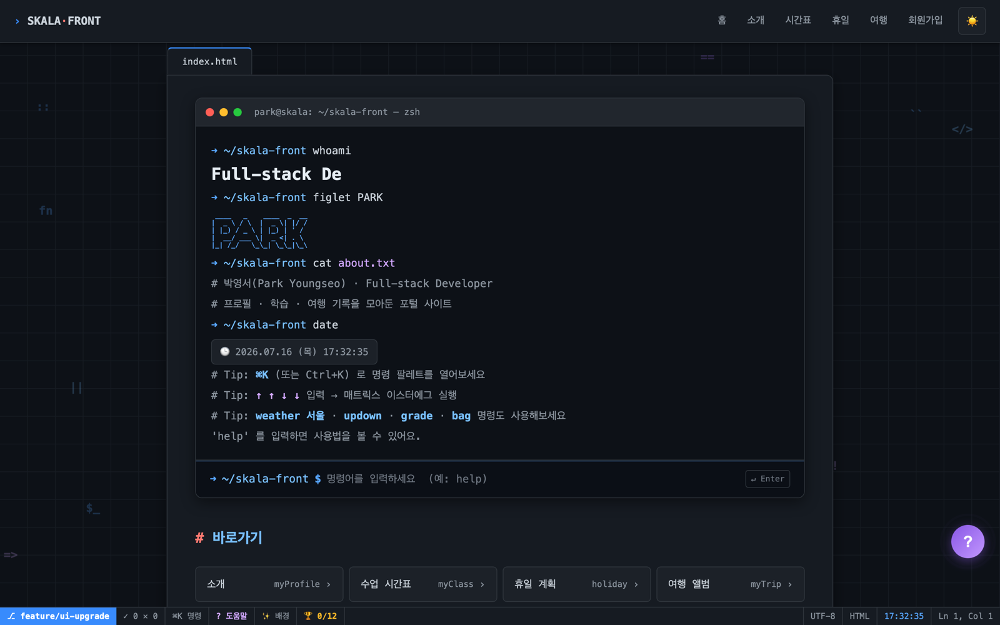 | 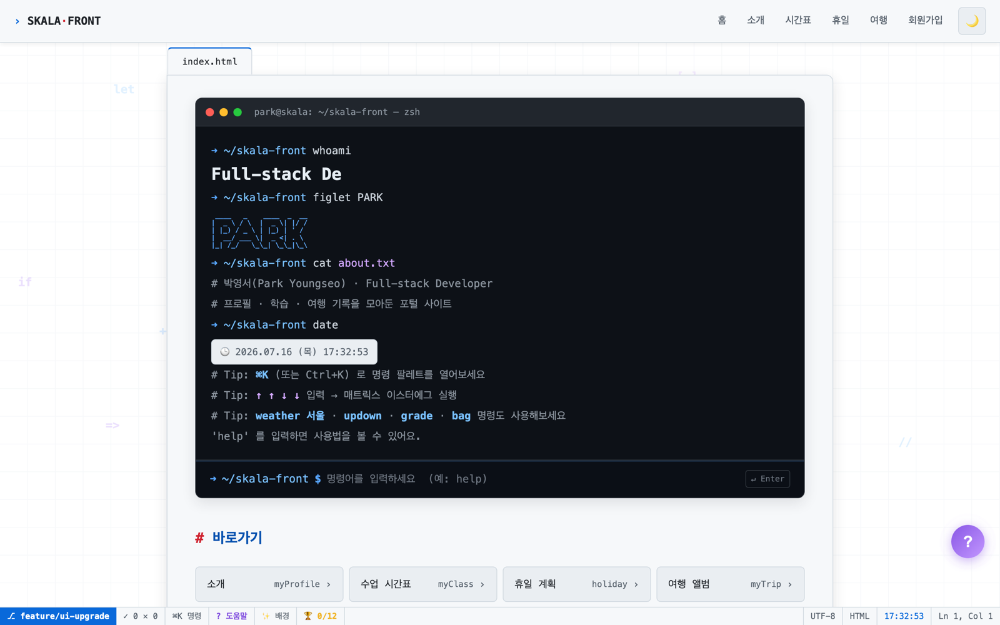 |

<p align="center">
  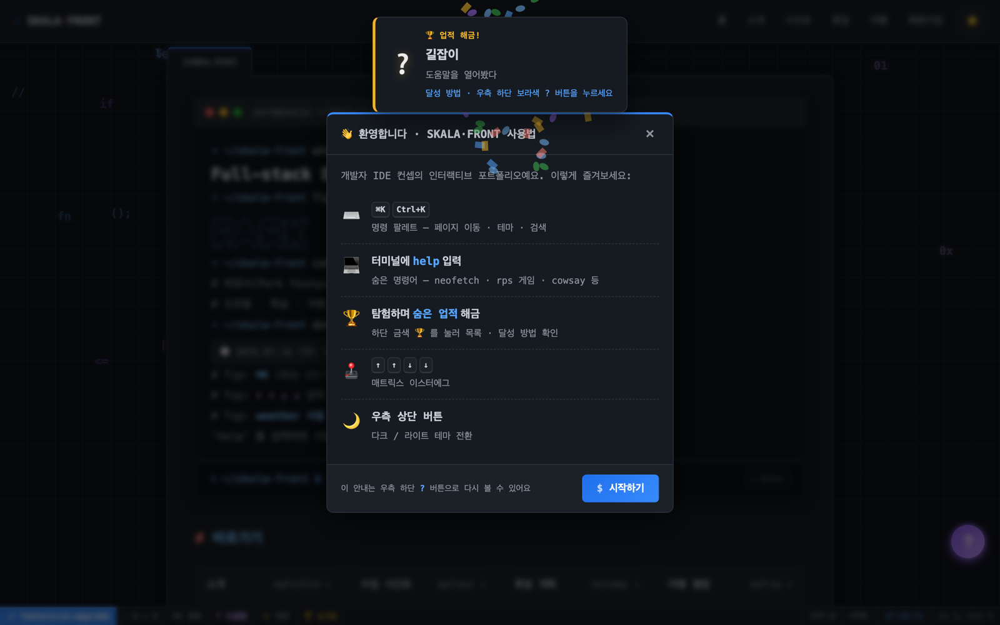
  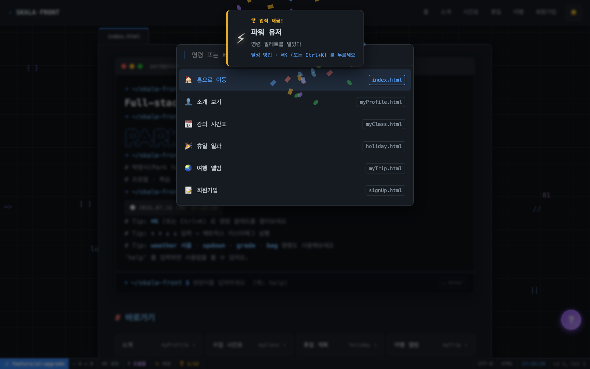
</p>
<p align="center">
  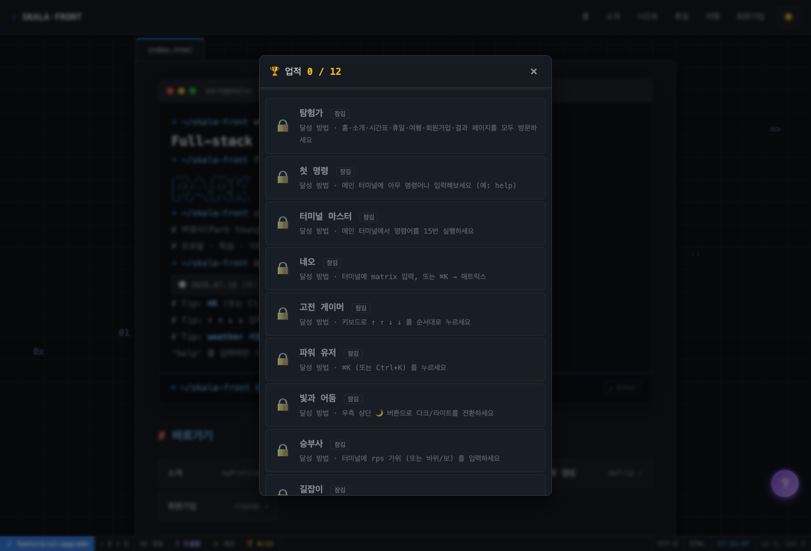
  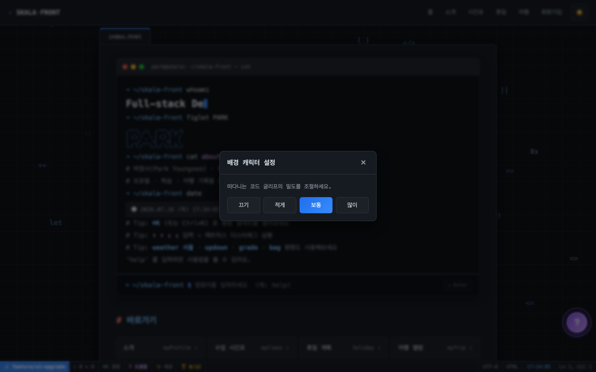
</p>

---

## 기술 스택

| 구분 | 사용 기술 |
|------|-----------|
| Markup | HTML5 (Semantic Elements, Forms, Media, Table) |
| Style | CSS3 (변수 · 다크/라이트 · 애니메이션 · Flex/Grid · 반응형) |
| Script | Vanilla JavaScript (DOM · 이벤트 · localStorage · Canvas · Fetch · IntersectionObserver) |
| Font | OS 기본 모노스페이스 폰트 (외부 폰트 미사용) |
| Tool | VS Code, Live Server |

---

## 폴더 구조

```
skala-front/
├── index.html              # Vercel 배포용 루트 → /html/index.html 리다이렉트
├── README.md
├── css/
│   └── style.css           # 전체 공통 스타일 (IDE 테마 · 애니메이션 · 반응형)
├── js/
│   ├── common.js           # 테마 · 상태바 · 명령 팔레트 · 스크롤 애니메이션
│   ├── effects.js          # 부팅 화면 · 페이지 전환 · 틸트 · 튜토리얼 · 히트맵
│   ├── terminal.js         # 인터랙티브 터미널 (명령어 인터프리터)
│   ├── achievements.js     # 업적 시스템 (해금 · 폭죽 · 패널)
│   ├── ambient.js          # 배경 코드 글리프 (상호작용 · 밀도 설정)
│   ├── supabaseConfig.js   # Supabase URL · publishable 키 (공개되는 값)
│   ├── supabaseClient.js   # supabase-js 클라이언트 생성 (ESM · CDN import)
│   ├── auth.js             # 가입 · 로그인 · 세션 · 프로필 헬퍼 (window.SkalaAuth)
│   ├── auth-ui.js          # 상단바 계정 칩 (로그인 상태 · 로그아웃 메뉴)
│   ├── signup.js           # 회원가입 폼 실시간 검증 + Supabase 가입
│   ├── login.js            # 로그인 페이지
│   ├── profile.js          # 내 계정 조회 · 수정 (myProfile 내 섹션)
│   ├── dock.js             # 우측 도크 (마크업 주입 · 탭 전환) — 모든 페이지
│   ├── guestbook.js        # 방명록 (익명 로그인 · 실시간 · 좋아요 · 페이지네이션)
│   ├── stats.js            # 방문자 수 · 업적 랭킹 · 인기 명령어
│   ├── canvas.js           # 함께 그리기 (공동 픽셀 캔버스 · 실시간)
│   ├── presence.js         # 지금 접속 중인 사람 · 실시간 커서
│   ├── result.js           # 가입 결과 요약 · 컨페티
│   ├── ui-dialog.js        # 테마 커스텀 모달 (skPrompt/skAlert — 기본 prompt/alert 대체)
│   ├── weatherAPI.js       # [과제] 실시간 날씨 · 비동기 fetch (ES6 모듈, export)
│   ├── realtimeInfo.js     # [과제] 실시간 날씨 · DOM/이벤트 (모듈 import)
│   ├── upDown.js           # [과제] Up-Down 숫자 맞추기 게임
│   ├── grade.js            # [과제] 성적 계산기 (배열 · 반복 · 평균)
│   └── bag.js              # [과제] 내 가방 보기 (객체 배열 · 반복)
└── html/
    ├── index.html          # 메인 포털 (인터랙티브 터미널)
    ├── myProfile.html      # 소개 (통계 · 활동 그래프 · 탭)
    ├── myClass.html        # 강의 시간표 (셀 병합 · 오늘 요일 강조)
    ├── holiday.html        # 휴일 일과 (타임라인 · details)
    ├── myTrip.html         # 여행 앨범 (갤러리 · 라이트박스 · 미디어)
    ├── signUp.html         # 회원가입 폼
    ├── signUpResult.html   # 회원가입 결과
    ├── login.html          # 로그인
    └── media/              # 사진 · 음악 · 영상 (플레이스홀더 포함)
docs/
└── supabase-schema.sql     # DB 테이블 · RLS 정책 · 트리거 (SQL Editor 에 붙여넣기)
```

---

## 우측 도크 패널 — 모든 페이지

**모든 페이지** 오른쪽 끝의 아이콘 바에서 4가지를 엽니다. VS Code 사이드바처럼
스크롤을 따라다녀서 어느 페이지에서든 언제든 열 수 있습니다.

| 탭 | 내용 |
|---|---|
| 💬 방명록 | 닉네임만으로 글 남기기 · 좋아요 · 실시간 반영 |
| 📊 사이트 현황 | 오늘/누적 방문자 · **인기 명령어 TOP 5** |
| 🏆 업적 랭킹 | 업적 해금 순위 TOP 10 + 내 순위 |
| 🎨 함께 그리기 | **공동 픽셀 캔버스** (32×32) |

- 마크업은 `dock.js` 가 주입합니다 — 7개 HTML 에 복붙하지 않고 한 곳에서 관리
- 아이콘 바는 항상 떠 있고, 패널은 눌렀을 때만 열립니다 (본문을 가리지 않음)
- 방명록은 **10개씩** 보여주고 "더 보기"로 늘립니다 (최대 100개). 긴 글은 4줄로 접힙니다
- 열려 있어도 다른 탭으로 바로 전환할 수 있고, `Esc` 로 닫힙니다
- 좁은 화면(≤820px)에서는 **하단 시트**로 바뀝니다
- 터미널에 `guestbook` · `visitors` · `ranking` 을 입력하거나 `⌘K` 명령 팔레트로도 열 수 있습니다
- 각 패널의 내용은 **처음 열릴 때** 로드됩니다 — 열지 않은 방문자에게는
  요청도 Realtime 웹소켓도 만들지 않습니다 (방문자 집계만 항상 실행)

---

## 실시간 기능

### 지금 접속 중인 사람 · 실시간 커서
상태바에 **`● N명 접속 중`** 이 실시간으로 뜨고, 같은 페이지를 보는 사람의
**마우스 커서**가 닉네임과 함께 화면에 나타납니다 (Figma 같은 느낌).

- Supabase Realtime 의 **presence + broadcast** 를 씁니다 → 테이블이 필요 없는 휴발성 데이터
- presence 와 커서가 **채널 하나를 공유**합니다 (웹소켓을 2개 열지 않으려고)
- 접속자 수는 **사이트 전체**, 커서는 **같은 페이지를 보는 사람만** 그립니다
- 보내는 것은 **닉네임과 좌표뿐** — 개인정보는 전송하지 않습니다
- `prefers-reduced-motion` 이면 커서를 감춥니다

**좌표는 콘텐츠(`.container`) 기준으로 보냅니다.** 뷰포트 기준(`clientY / innerHeight`)으로
보내면 상대가 페이지를 아래로 내려 다른 내용을 가리켜도 내 화면의 같은 자리에 커서가 떠서,
스크롤 위치가 전혀 반영되지 않습니다.

| 축 | 보내는 값 | 이유 |
|---|---|---|
| x | 컨테이너 폭 대비 비율(0~1) | 창 너비가 달라도 같은 내용을 가리킴 |
| y | 컨테이너 위에서 몇 px | 스크롤·화면 높이와 무관하게 같은 지점에 붙음 |

커서 레이어는 `position: fixed` + `overflow: hidden` 이고, 스크롤·리사이즈 시
JS 가 위치를 다시 계산합니다(rAF 로 프레임당 1회). `absolute` 로 두면 코드는
간단해지지만, 화면 밖 커서의 닉네임 라벨이 문서를 넓혀 **가로 스크롤바가 생깁니다**.

### 인기 명령어 TOP 5
방문자들이 터미널에 많이 입력한 명령어를 집계해 보여주고, **눌러서 바로 실행**할 수 있습니다.

> **인자는 저장하지 않습니다.** `echo`·`cowsay` 뒤에 무엇을 썼는지는 개인정보가 될 수 있어
> **알려진 명령어 이름만** 기록합니다. 화이트리스트에 없는 입력은 DB 가 조용히 무시합니다.

### 함께 그리기 (공동 픽셀 캔버스)
모든 방문자가 같은 32×32 도화지를 공유합니다. 남이 칠한 칸도 덮어쓸 수 있고(r/place 방식),
변경은 Realtime 으로 즉시 퍼집니다. 도배 방지로 **한 사람당 2초에 한 칸**(DB 트리거).

---

## 디자인 컨셉 — 개발자 터미널 / IDE

- **VS Code 다크 테마** 기반 · 우측 상단 버튼으로 **라이트 테마 토글** (localStorage 저장)
- 모노스페이스 폰트 + `$` `#` 프롬프트 스타일 헤딩 + 문법 강조 색상(블루 계열)
- 상단 **에디터 탭바**, 컨테이너마다 **파일명 탭**(`index.html` 등)
- 화면 하단 **VS Code 스타일 상태바** (git 브랜치 · 인코딩 · 실시간 시계 · 업적 진행도)
  · 클릭 가능 항목(도움말 · 배경 설정 · 업적) + **클릭 위치 좌표**(`Ln, Col`) 실시간 표시

---

## 인터랙티브 터미널

메인 페이지 히어로가 **직접 명령어를 입력하는 터미널**입니다. `help` 로 시작하세요.

| 명령어 | 동작 |
|--------|------|
| `about` `skills` `projects` | 자기소개 · 기술 스택 · 프로젝트 |
| `awards` `certs` `contact` | 수상 · 자격증 · 연락처 |
| `ls` · `goto <page>` | 페이지 목록 · 이동 |
| `weather <도시>` | 실시간 날씨 조회 (Open-Meteo API) |
| `updown` `grade` `bag` | 미니 앱 실행 (숫자 게임 · 성적 계산기 · 내 가방) |
| `neofetch` | 개발자 정보 ASCII 아트 |
| `cowsay <말>` · `rps <가위\|바위\|보>` | ASCII 소 · 가위바위보 게임 |
| `joke` `coffee` `sudo` | 유머 · 커피 · xkcd 개그 |
| `theme` `matrix` `achievements` | 테마 전환 · 이스터에그 · 업적 목록 |

- `↑` / `↓` 명령 히스토리, `clear` 초기화, 없는 명령 처리

| `help` — 명령어 목록 | `coffee` · `cowsay` · `joke` 이스터에그 |
|:---:|:---:|
| 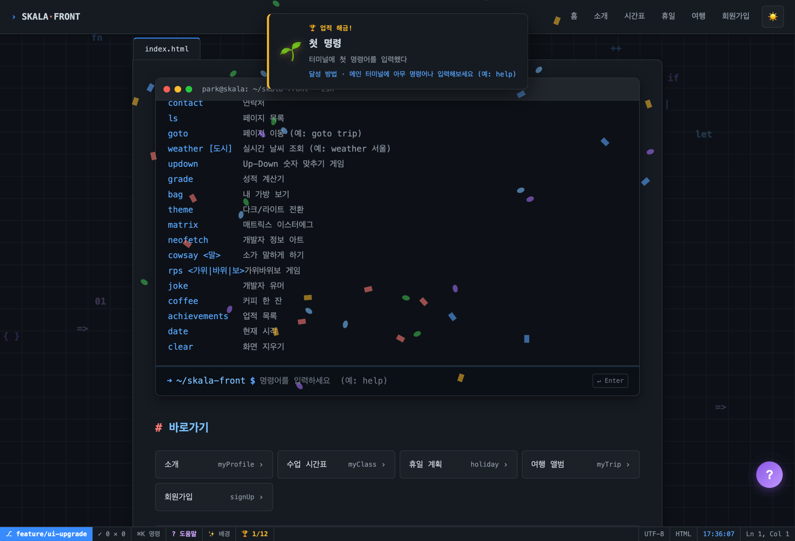 | 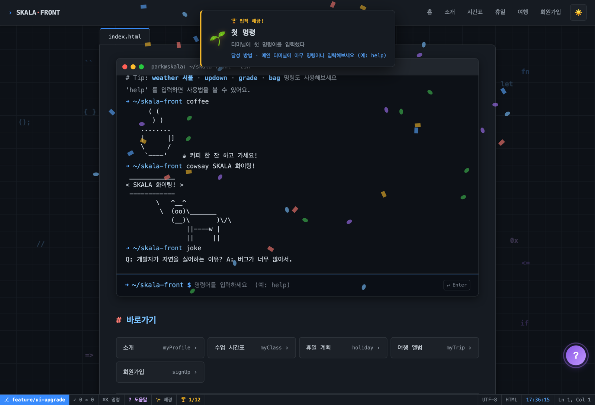 |

---

## 업적 시스템 & 기타 인터랙션

| 기능 | 설명 |
|------|------|
| 업적 시스템 | 탐험하며 **숨은 업적 해금** → 폭죽 + 배너(설명·달성 방법), 하단 🏆 클릭 시 전체 목록 |
| 배경 코드 글리프 | `</>` `{ }` `=>` 등이 배경을 유영 · **마우스 근처면 밀려나며 밝아지고 클릭 시 퍼짐** · 밀도 설정(끄기/적게/보통/많이) |
| 첫 방문 튜토리얼 | 처음 접속 시 사용법 안내 모달 (재열람: 우측 하단 `?` 버튼) |
| 명령 팔레트 | `⌘K` / `Ctrl+K` — 페이지 이동 · 테마 · 업적 · 검색 |
| 인트로 부팅 화면 | 첫 진입 시 터미널 부팅 로그 타이핑 (세션 1회) |
| 페이지 전환 · 스크롤 진행바 | 페이드 + 상단 로딩바, 읽은 만큼 채워지는 바 |
| 카드 3D 틸트 | 마우스 추적 입체 효과 |
| 통계 카운터 · 활동 그래프 | 소개 페이지 숫자 카운트업, **GitHub 실제 커밋 히트맵** |
| 이스터에그 | `↑↑↓↓` → 매트릭스 레인 |
| 폼 검증 · 라이트박스 · 시간표 강조 | 실시간 검증, 사진 확대, 오늘 요일 자동 강조 |

---

## 페이지별 핵심 학습 요소

| 페이지 | 핵심 태그 · 개념 |
|--------|------------------|
| `index.html` | `<header> <nav> <main> <aside> <footer>`, `<a>` 내비게이션 |
| `myProfile.html` | `<ul>` `<ol>` `<dl><dt><dd>` |
| `myClass.html` | `<table><thead><tbody>`, `rowspan` / `colspan` 셀 병합 |
| `holiday.html` | `<h1>~<h2>` `<p>` `<br>` `<mark>` `<hr>` `<details>` |
| `myTrip.html` | `<figure><figcaption>` `` `<audio>` `<video>` `<source>` |
| `signUp.html` | `<form><fieldset><legend><label>`, 다양한 `<input>` · `<select>` · `<textarea>` |
| `signUpResult.html` | `method="get"` 폼 전송 · 앵커 링크 |

> **소개 페이지** — 프로필 카드 · 통계 · **실제 GitHub 커밋 히트맵** · 탭 전환
>
> 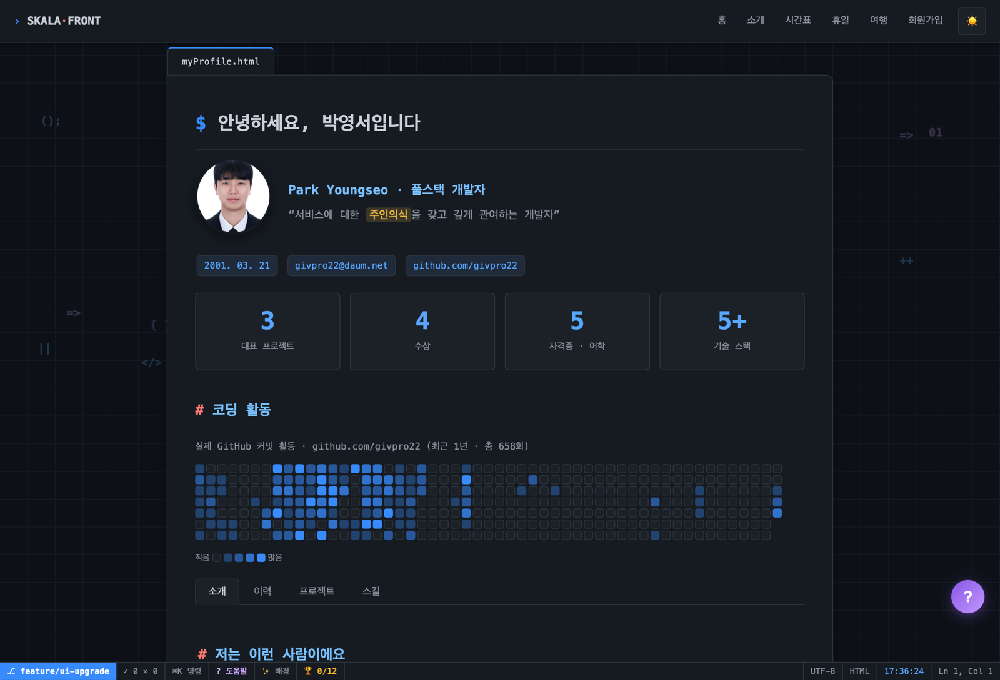

---

## JavaScript 실습 과제

강의 실습 과제를 메인 페이지(`index.html`) 우측 **실시간 날씨 / 미니 앱** 영역에서 직접 실행할 수 있습니다.

| 실시간 날씨 위젯 | 미니 앱 카드 런처 | 커스텀 테마 모달 |
|:---:|:---:|:---:|
| 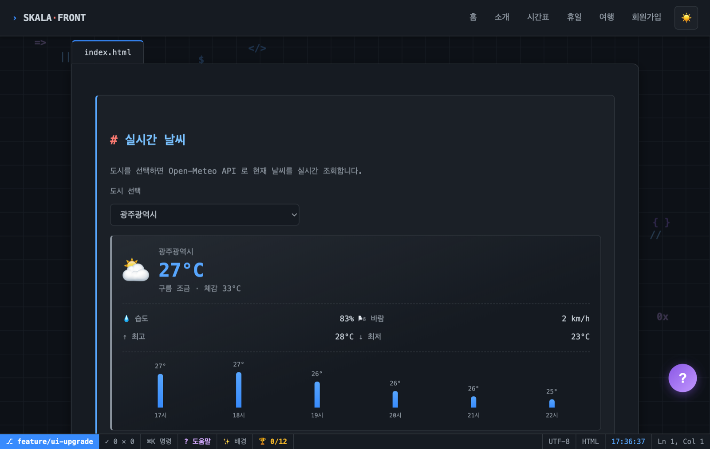 | 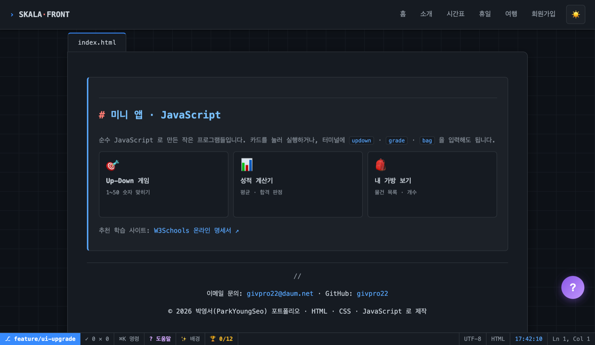 | 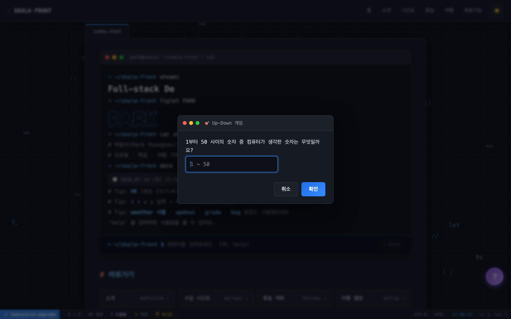 |

| 과제 | 파일 | 핵심 개념 |
|------|------|-----------|
| 실시간 날씨 — 모듈 분리 | `js/weatherAPI.js` | ES6 `export` · 관심사 분리 |
| 실시간 날씨 — 비동기 호출 | `js/weatherAPI.js` | `async/await` · `fetch` (Open-Meteo API) |
| 실시간 날씨 — DOM · 이벤트 | `js/realtimeInfo.js` | `import` · `change` 이벤트 · `innerHTML` 갱신 |
| Up-Down 숫자 맞추기 게임 | `js/upDown.js` | `Math.random` · `while` · `prompt`/`alert` |
| 성적 계산기 | `js/grade.js` | 배열 · `for` 반복 · 평균 · 합격 판정 |
| 내 가방 보기 | `js/bag.js` | 객체 배열 · `for` 반복 · `alert` 출력 |

- 날씨 위젯은 도시 `<select>` 를 바꾸면 `change` 이벤트로 API 를 비동기 호출해 **현재/체감온도 · 습도 · 풍속 · 최고·최저 · 시간별 미니 예보(sparkline)** 를 실시간 표시합니다. 날씨 상태(맑음·비·눈·뇌우 등)에 따라 카드 배경 톤이 바뀝니다.
- 모듈 스크립트는 `<script type="module">` 로 로드되어 `import`/`export` 가 동작합니다 → `file://` 보다 **Live Server**에서 안정적입니다.
- 미니 앱은 **카드형 런처**(우측 aside)에서 실행하거나, 인터랙티브 터미널에 `weather <도시>` · `updown` · `grade` · `bag` 을 입력해도 실행됩니다. (게임/계산기는 전역 함수 `startUpDown` · `startGrade` · `showMyBag` 를 재사용)
- 입력/출력은 브라우저 기본 `prompt`/`alert`(스타일 불가) 대신 **사이트 테마에 맞춘 커스텀 모달**(`ui-dialog.js` → `skPrompt`/`skAlert`)을 사용합니다. 과제 로직(`Math.random`·`while`/`for`·배열·조건문)은 그대로이고, 모듈이 없으면 기본 `prompt`/`alert` 로 자동 대체됩니다.
- 실시간 날씨 조회 / 미니 앱 실행 시 **업적**(기상캐스터 · 미니앱 플레이어)이 해금됩니다.

---

## 실행 방법

1. 저장소를 클론합니다.
   ```bash
   git clone https://github.com/givpro22/skala-front.git
   ```
2. VS Code에서 폴더를 엽니다.
3. `html/index.html`을 열고 **Live Server** (우측 하단 `Go Live`)로 실행합니다.

> 처음 들어가면 튜토리얼이 뜹니다. 터미널에 `help`, `⌘K` 명령 팔레트, `↑↑↓↓` 이스터에그,
> 그리고 사이트를 돌아다니며 업적을 해금해 보세요.
> GitHub 활동 그래프는 외부 요청이 있어 `file://` 보다 **Live Server**에서 안정적으로 동작합니다.
> 회원가입·로그인도 ES 모듈을 쓰므로 `file://` 이 아닌 **Live Server**에서 열어야 합니다.

---

## Supabase 백엔드 설정

회원가입·로그인·프로필·업적 동기화·방명록·방문자 수·랭킹이 Supabase 를 사용합니다.
설정하지 않아도 사이트는 정상 동작하며(업적은 localStorage 에만 저장), 서버 기능만 비활성화됩니다.

1. **DB 스키마 만들기**
   Supabase 대시보드 → **SQL Editor** → [`docs/supabase-schema.sql`](docs/supabase-schema.sql) 내용을 붙여넣고 Run.
   테이블과 **RLS 정책**, 가입 시 프로필을 자동 생성하는 트리거, 집계용 RPC 가 만들어집니다.
   재실행해도 안전합니다(`if not exists` / `create or replace`).

2. **publishable 키 넣기**
   대시보드 → **Project Settings → API Keys** → `publishable` 키를 복사해
   [`js/supabaseConfig.js`](js/supabaseConfig.js) 의 `publishableKey` 에 붙여넣습니다.

3. **익명 로그인 켜기 (방명록에 필수)**
   Authentication → **Sign In / Providers** → **Anonymous sign-ins** 활성화.
   방명록은 이메일·비밀번호 없이 닉네임만으로 남기는데, 내부적으로 익명 세션을 발급해
   "본인 글만 삭제" 를 RLS 로 보장합니다. 꺼져 있으면 방명록 작성이 실패합니다.

4. **이메일 인증 끄기 (사실상 필수)**
   Authentication → **Sign In / Providers → Email → Confirm email** 을 **끕니다**.
   그러면 가입 즉시 로그인되고 상단바에 계정이 바로 나타납니다.

   > 켜 두면 가입할 때마다 인증 메일을 보내는데, Supabase 기본 SMTP 는
   > **시간당 2건**(무료 플랜)이라 금방 `email rate limit exceeded` 로 막힙니다.
   > 포트폴리오 데모에서는 끄는 편이 맞습니다. 실서비스라면 켜고 전용 SMTP 를 붙이세요.

### 데이터 구조

| 테이블 / 함수 | 용도 | 공개 범위 |
|---|---|---|
| `profiles` | 회원 정보 (실명·생년월일 포함) | **본인만** — RLS |
| `achievements` | 해금한 업적 | 본인만 — RLS |
| `guestbook` | 방명록 글 | 읽기 공개 · 작성/삭제는 본인만 |
| `guestbook_likes` | 좋아요 | 읽기 공개 · 1인 1회(PK 로 강제) |
| `daily_visits` | 방문 기록 | **직접 접근 불가** — RPC 집계값만 |
| `command_stats` | 명령어 사용 횟수 | 읽기 공개 · 쓰기는 RPC 로만 |
| `canvas_pixels` | 공동 캔버스 | 읽기 공개 · 칠하기는 로그인 필요 (2초 제한) |
| `guestbook_list()` | 방명록 + 닉네임 + 좋아요 | 닉네임만 노출 |
| `achievement_leaderboard()` | 랭킹 TOP 10 | 닉네임 + 개수만 |
| `popular_commands()` | 인기 명령어 | 명령어 이름 + 횟수만 (인자 저장 안 함) |

> **실명은 공개되지 않습니다.** 방명록·랭킹에는 `profiles.nickname` 만 나가며,
> `name`(실명)·이메일·생년월일은 어떤 공개 경로로도 조회되지 않습니다.
> 로컬 PostgreSQL 로 위 RLS 경계를 전부 검증했습니다(남의 글 삭제·남의 이름으로 작성·
> 남의 프로필 조회·방문 기록 직접 읽기 모두 차단 확인).

### 🔑 키에 대해

| 키 | 어디에 두나 | 공개해도 되나 |
|---|---|---|
| `publishable` (anon) | `js/supabaseConfig.js` — 브라우저로 전달됨 | **예.** 공개가 정상이며, 접근 제어는 RLS 가 담당 |
| `secret` (service role) | **이 저장소에 두지 않음** | **아니오.** RLS 를 전부 우회 — 정적 사이트에는 둘 곳이 없음 |

> 이 프로젝트는 서버가 없는 정적 사이트라 `secret` 키를 쓰지 않습니다.
> 데이터 보호는 전적으로 `docs/supabase-schema.sql` 의 RLS 정책에 의존하므로,
> 정책을 지우거나 끄면 테이블이 그대로 공개됩니다.

### Vercel 배포
- **배포 완료**: [skala-front-ys.vercel.app](https://skala-front-ys.vercel.app/)
- 루트 `index.html`이 `/html/index.html`로 리다이렉트하도록 되어 있어, 저장소를 그대로 임포트하면 됩니다.
- Framework Preset: **Other**, Root Directory: `./`, Build/Output: 비워두기.

---

## 과제 완료 체크리스트

### HTML
- [x] Project 구성과 index.html 생성
- [x] 나의 소개 (myProfile)
- [x] 나의 강의 일정 (myClass)
- [x] 바로가기 (index 내비게이션)
- [x] 회원가입 (signUp)
- [x] 회원가입 결과 (signUpResult)
- [x] 나의 여행지 (myTrip)
- [x] 포털 사이트형 메인 Hub

### CSS
- [x] 미션1 — 전체 테마 및 텍스트 Styling
- [x] 미션2 — 박스 모델의 이해
- [x] 미션3 — 가독성 높은 회원가입 폼

### 심화 (CSS · JavaScript)
- [x] CSS 변수 · 다크/라이트 테마 전환
- [x] 애니메이션 · 트랜지션 · 화면 전환 효과
- [x] Flexbox · Grid 레이아웃 · 반응형 (Media Query)
- [x] 인터랙티브 터미널 · 명령 팔레트
- [x] 업적 시스템 · 튜토리얼 · 이스터에그
- [x] GitHub 활동 그래프 (Fetch API)

### JavaScript 실습 과제
- [x] 실시간 날씨 — 모듈 분리 (`weatherAPI.js`)
- [x] 실시간 날씨 — 비동기 호출 (`async/await` · `fetch`)
- [x] 실시간 날씨 — DOM 조작 · 이벤트 처리 (`realtimeInfo.js`)
- [x] Up-Down 숫자 맞추기 게임 (`upDown.js`)
- [x] 성적 계산기 (`grade.js`)
- [x] 내 가방 보기 (`bag.js`)
